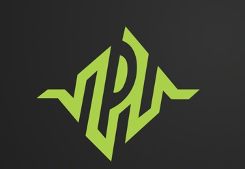

<div align="center">



# PixelPulse Innovation AI

**An AI-powered photography coaching chatbot that analyses any photo and teaches beginners how to master it.**


[Live Demo](#) · [Report Bug](https://github.com/YehyaAyyash/PhotoMentor-Ai/issues) · [Request Feature](https://github.com/YehyaAyyash/PhotoMentor-Ai/issues)

</div>

---

## 📸 What is PixelPulse Innovation AI?

PixelPulse Innovation AI is an intelligent photography coaching assistant built for beginners. Upload any photo — captured or AI-generated — and get instant, concise coaching delivered in a clean chat interface.

No photography experience needed. Just upload and learn.

---

## ✨ Features

| Feature | Description |
|---|---|
| 🔆 **Lighting Analysis** | Identifies light type, direction, quality & mood |
| 📷 **Camera Settings** | Estimates aperture, shutter speed, ISO & focal length |
| 💡 **Recreation Guide** | 3-step beginner-friendly guide to recreate the shot |
| 🏆 **Pro Tips** | Standout techniques & common mistakes to avoid |
| 🎓 **Course Picks** | 2 curated courses matched to the photo style |
| 💬 **Chat Interface** | Conversational UI with message history & clear chat |

---

## 🖥️ Preview

> Dark grey background · `#8FD14F` green accent · Chat bubble layout

```
┌─────────────────────────────────────────────┐
│  🟢 PixelPulse Innovation AI                │
│  Photography Coaching · GPT-4o Mini         │
├─────────────────────────────────────────────┤
│                                             │
│  [User bubble] Analyse this photo.          │
│  [📷 uploaded image preview]                │
│                                             │
│  AI ┃ ✨ Shot Summary                       │
│     ┃ 🔆 Lighting                           │
│     ┃ 📷 Camera Settings                    │
│     ┃ 💡 How to Recreate                    │
│     ┃ 🏆 Pro Tip                            │
│     ┃ 🎓 Learn More                         │
│                                             │
│  [ Upload Photo ]  [ Optional context... ]  │
│  [      📸 Analyse Photo      ]             │
└─────────────────────────────────────────────┘
```

---

## 🛠️ Tech Stack

| Layer | Technology |
|---|---|
| **Frontend** | [Streamlit](https://streamlit.io) |
| **AI Vision** | [OpenAI GPT-4o Mini](https://platform.openai.com/docs/models/gpt-4o-mini) |
| **Image Processing** | Pillow |
| **Language** | Python 3.9+ |

---

## ⚡ Run Locally

**1. Clone the repo**
```bash
git clone https://github.com/YehyaAyyash/PhotoMentor-Ai.git
cd PhotoMentor-Ai
```

**2. Install dependencies**
```bash
pip install -r requirements.txt
```

**3. Add your OpenAI API key**

Option A — `.env` file:
```bash
cp .env.example .env
# Open .env and set:
# OPENAI_API_KEY=sk-...
```

Option B — paste directly in the app sidebar (no setup needed).

**4. Run**
```bash
streamlit run app.py
```

Open [http://localhost:8501](http://localhost:8501) in your browser.

> **Get an API key:** [platform.openai.com](https://platform.openai.com) → API Keys → Create new secret key
> **Cost:** ~$0.001 per photo analysis

---

## ☁️ Deploy on Streamlit Cloud (Free)

1. Push this repo to GitHub
2. Go to [share.streamlit.io](https://share.streamlit.io) and sign in with GitHub
3. Click **New app** → select this repo → set main file: `app.py`
4. Go to **Advanced settings → Secrets** and add:
   ```toml
   OPENAI_API_KEY = "sk-..."
   ```
5. Click **Deploy** — your app is live!

---

## 📁 Project Structure

```
PhotoMentor-Ai/
├── app.py                        # Main Streamlit application
├── assets/
│   └── logo.png                  # PixelPulse Innovation AI logo
├── .streamlit/
│   └── secrets.toml.example      # Secrets template for deployment
├── requirements.txt              # Python dependencies
├── .env.example                  # API key template
├── .gitignore
└── README.md
```

---

## 🔭 Future Roadmap

### 🤖 AI Enhancements
- [ ] **Multi-turn chat** — ask follow-up questions about the same photo
- [ ] **Before/After comparison** — upload two photos and compare techniques
- [ ] **Style matching** — "make my photo look like this reference"
- [ ] **Gear recommender** — suggest camera & lens combos based on the shot

### 📚 Learning Features
- [ ] **Progress tracker** — save analyses and track skill growth over time
- [ ] **Daily challenge** — upload a photo matching a given style prompt
- [ ] **Glossary mode** — tap any term for a quick beginner explainer
- [ ] **Quiz mode** — test your knowledge based on analysed photos

### 🌐 Platform & UX
- [ ] **Mobile-optimised UI** — smoother camera upload on phones
- [ ] **Export to PDF** — save full analysis as a printable guide
- [ ] **Community gallery** — share and learn from other users' shots
- [ ] **Multi-language support** — coaching in Arabic, French, Spanish & more

### 🔗 Integrations
- [ ] **Instagram import** — analyse photos directly from a profile URL
- [ ] **Lightroom presets** — auto-generate presets from analysis
- [ ] **YouTube matching** — link analysis to relevant tutorial timestamps

---

## 🤝 Contributing

Pull requests are welcome! For major changes please open an issue first to discuss what you'd like to change.

1. Fork the repo
2. Create your branch: `git checkout -b feature/your-feature`
3. Commit your changes: `git commit -m 'Add your feature'`
4. Push to the branch: `git push origin feature/your-feature`
5. Open a Pull Request

---

## 📄 License

Distributed under the MIT License. See `LICENSE` for more information.

---

<div align="center">
  <strong style="color:#8FD14F">PixelPulse Innovation AI</strong><br/>
  Made with ❤️ by <a href="https://github.com/YehyaAyyash">Yahya Ayyash</a>
</div>
